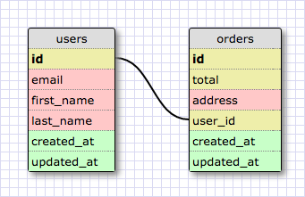

# Schema Design: One-to-many Schema

## Summary
A database of any complexity will store data for multiple things.  For example, a classroom database could hold data for people, grades, homework assignments, etc.  For each of these, we would create a separate table:  a table to hold data for people, a table to hold data for grades, etc.

One of the benefits of relational databases is the ability to associate data in one table to data in another table.  In the classroom example, we would want to associate specific grades with specific students.

We can associate data in different tables in multiple ways—in other words, define different types of relationships between the tables.  One of these relationships is one-to-many.

One example of a one-to-many relationship is making an online order at, say, Amazon.com.  A user can make many orders, but each order belongs to exactly one user.  Given a user, we would be able to find many orders associated with that particular user.  Conversely, given an order, we would find only one user associated with the order.

### Primary Keys and Foreign Keys
  
*Figure 1*.  Simplified schema design for users and orders at an e-commerce site.

How do we associate data in one table with data in another?  To start, we give each record in our database a unique identifier, a value that only this one record can have.  We call this unique identifier a *primary key*.  The default is to use an *id* field that contains a unique integer value.

In our users-orders e-commerce example, each user would have a unique id.  We can then use these unique identifiers in another table.  In Figure 1, each order keeps track of the user who placed the order in the *user_id* field.  *user_id* is an example of a *foreign key*, a field whose value points to a row of data in another table–in this case, a row in the users table.

When relating two tables with each other, we'll match data from the primary key in one table with data from the foreign key in the other table.  It's important that the foreign key is created on the right table; otherwise, the relationship between the tables would be reversed.

The foreign key belongs on the table for the *many* side of the relationship.  In our example, we want a user to have many orders.  So, orders is the many side of this relationship.  Therefore, the orders table needs a foreign key that will point to the specific user who made the order.  By convention, this foreign key field is named *user_id*.

## Releases
### Pre-release:  Read and Run the Movie Showtime Script
We have a small script that displays movie showtimes for each screen in a few movie theaters (see `runner.rb`).  Take a look through the code base.  See which classes are present and how they relate to each other.  We can proceed to the next release when we feel comfortable that we understand the how the script works and how the different classes relate to each other.

### Release 0: Design a Database Schema to Support the Program
The user of this script is interested in expanding it, and we need to design a database schema that will support the application.  In other words, we need to design a database that will store the data that is currently contained within the file `runner.rb`:  which theaters there are, their names, which screens each theater has, etc.

We should use the [Schema Designer][] to create our schema.  When our schema is complete, take a screenshot of the design and commit it.

## Conclusion
We'll be designing databases to support our applications throughout the rest of our time at Dev Bootcamp.  It's critical that we understand how to design databases that allow relating objects of one type to objects of another type.  The one-to-many relationship that we looked at in this challenge is a common relationship type, and it's critical that we understand how to model the relationship in our databases.

[Schema Designer]: https://schemadesigner.devbootcamp.com/
